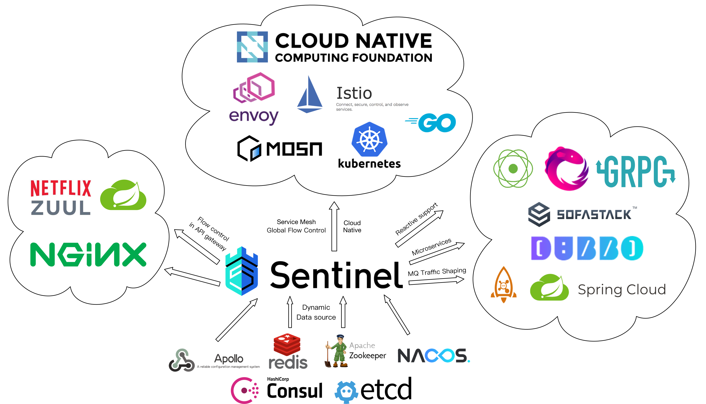

# Sentinel: The Sentinel of Your Microservices

[](https://github.com/alibaba/Sentinel/actions/workflows/ci.yml)
[](https://codecov.io/gh/alibaba/Sentinel)
[](https://search.maven.org/search?q=g:com.alibaba.csp%20AND%20a:sentinel-core)
[](https://www.apache.org/licenses/LICENSE-2.0.html)
[](https://gitter.im/alibaba/Sentinel)
[](https://opensource.alibaba.com/contribution_leaderboard/details?projectValue=sentinel)

## Introduction

As distributed systems become increasingly popular, the reliability between services is becoming more important than ever before.
Sentinel takes "flow" as breakthrough point, and works on multiple fields including **flow control**, **traffic shaping**,
**concurrency limiting**, **circuit breaking** and **system adaptive overload protection**,
to guarantee reliability and resilience for microservices.

Sentinel has the following features:

- **Rich applicable scenarios**: Sentinel has been wildly used in Alibaba, and has covered almost all the core-scenarios in Double-11 (11.11) Shopping Festivals in the past 10 years, such as “Second Kill” which needs to limit burst flow traffic to meet the system capacity, message peak clipping and valley fills, circuit breaking for unreliable downstream services, cluster flow control, etc.
- **Real-time monitoring**: Sentinel also provides real-time monitoring ability. You can see the runtime information of a single machine in real-time, and the aggregated runtime info of a cluster with less than 500 nodes.
- **Widespread open-source ecosystem**: Sentinel provides out-of-box integrations with commonly-used frameworks and libraries such as Spring Cloud, gRPC, Apache Dubbo and Quarkus. You can easily use Sentinel by simply add the adapter dependency to your services.
- **Polyglot support**: Sentinel has provided native support for Java, [Go](https://github.com/alibaba/sentinel-golang), [C++](https://github.com/alibaba/sentinel-cpp) and [Rust](https://github.com/sentinel-group/sentinel-rust).
- **Various SPI extensions**: Sentinel provides easy-to-use SPI extension interfaces that allow you to quickly customize your logic, for example, custom rule management, adapting data sources, and so on.

Features overview:


The community is also working on **the specification of traffic governance and fault-tolerance**.
Please refer to [OpenSergo](https://opensergo.io/) for details.

## Documentation

See the [Sentinel Website](https://sentinelguard.io/) for the official website of Sentinel.

See the [中文文档](https://sentinelguard.io/zh-cn/docs/introduction.html) for document in Chinese.

See the [Wiki](https://github.com/alibaba/Sentinel/wiki) for full documentation, examples, blog posts, operational details and other information.

Sentinel provides integration modules for various open-source frameworks
(e.g. Spring Cloud, Apache Dubbo, gRPC, Quarkus, Spring WebFlux, Reactor) and service mesh.
You can refer to [the document](https://sentinelguard.io/en-us/docs/open-source-framework-integrations.html) for more information.

If you are using Sentinel, please [**leave a comment here**](https://github.com/alibaba/Sentinel/issues/18) to tell us your scenario to make Sentinel better.
It's also encouraged to add the link of your blog post, tutorial, demo or customized components to [**Awesome Sentinel**](./doc/awesome-sentinel.md).

## Ecosystem Landscape



## Quick Start

Below is a simple demo that guides new users to use Sentinel in just 3 steps. It also shows how to monitor this demo using the dashboard.

### 1. Add Dependency

**Note:** Sentinel requires JDK 1.8 or later.

If you're using Maven, just add the following dependency in `pom.xml`.

```xml
<!-- replace here with the latest version -->
<dependency>
    <groupId>com.alibaba.csp</groupId>
    <artifactId>sentinel-core</artifactId>
    <version>1.8.6</version>
</dependency>
```

If not, you can download JAR in [Maven Center Repository](https://mvnrepository.com/artifact/com.alibaba.csp/sentinel-core).

### 2. Define Resource

Wrap your code snippet via Sentinel API: `SphU.entry(resourceName)`.
In below example, it is `System.out.println("hello world");`:

```java
try (Entry entry = SphU.entry("HelloWorld")) {
    // Your business logic here.
    System.out.println("hello world");
} catch (BlockException e) {
    // Handle rejected request.
    e.printStackTrace();
}
// try-with-resources auto exit
```

So far the code modification is done. We've also provided [annotation support module](https://github.com/alibaba/Sentinel/blob/master/sentinel-extension/sentinel-annotation-aspectj/README.md) to define resource easier.

### 3. Define Rules

If we want to limit the access times of the resource, we can **set rules to the resource**.
The following code defines a rule that limits access to the resource to 20 times per second at the maximum.

```java
List<FlowRule> rules = new ArrayList<>();
FlowRule rule = new FlowRule();
rule.setResource("HelloWorld");
// set limit qps to 20
rule.setCount(20);
rule.setGrade(RuleConstant.FLOW_GRADE_QPS);
rules.add(rule);
FlowRuleManager.loadRules(rules);
```

For more information, please refer to [How To Use](https://sentinelguard.io/en-us/docs/basic-api-resource-rule.html).

### 4. Check the Result

After running the demo for a while, you can see the following records in `~/logs/csp/${appName}-metrics.log.{date}` (When using the default `DateFileLogHandler`).

```
|--timestamp-|------date time----|-resource-|p |block|s |e|rt  |occupied
1529998904000|2018-06-26 15:41:44|HelloWorld|20|0    |20|0|0   |0
1529998905000|2018-06-26 15:41:45|HelloWorld|20|5579 |20|0|728 |0
1529998906000|2018-06-26 15:41:46|HelloWorld|20|15698|20|0|0   |0
1529998907000|2018-06-26 15:41:47|HelloWorld|20|19262|20|0|0   |0
1529998908000|2018-06-26 15:41:48|HelloWorld|20|19502|20|0|0   |0
1529998909000|2018-06-26 15:41:49|HelloWorld|20|18386|20|0|0   |0

p stands for incoming request, block for blocked by rules, s for success handled by Sentinel, e for exception count, rt for average response time (ms), occupied stands for occupiedPassQps since 1.5.0 which enable us booking more than 1 shot when entering.
```

This shows that the demo can print "hello world" 20 times per second.

More examples and information can be found in the [How To Use](https://sentinelguard.io/en-us/docs/basic-api-resource-rule.html) section.

The working principles of Sentinel can be found in [How it works](https://sentinelguard.io/en-us/docs/basic-implementation.html) section.

Samples can be found in the [sentinel-demo](https://github.com/alibaba/Sentinel/tree/master/sentinel-demo) module.

### 5. Start Dashboard

> Note: Java 8 is required for building or running the dashboard.

Sentinel also provides a simple dashboard application, on which you can monitor the clients and configure the rules in real time.


For details please refer to [Dashboard](https://github.com/alibaba/Sentinel/wiki/Dashboard).

## Trouble Shooting and Logs

Sentinel will generate logs for troubleshooting and real-time monitoring.
All the information can be found in [logs](https://sentinelguard.io/en-us/docs/logs.html).

## Bugs and Feedback

For bug report, questions and discussions please submit [GitHub Issues](https://github.com/alibaba/sentinel/issues).

Contact us via [Gitter](https://gitter.im/alibaba/Sentinel) or [Email](mailto:sentinel@linux.alibaba.com).

## Contributing

Contributions are always welcomed! Please refer to [CONTRIBUTING](./CONTRIBUTING.md) for detailed guidelines.

You can start with the issues labeled with [`good first issue`](https://github.com/alibaba/Sentinel/issues?q=is%3Aissue+is%3Aopen+label%3A%22good+first+issue%22).

## Enterprise Service

If you need Sentinel enterprise service support (Sentinel 企业版), or purchase cloud product services,
you can join the discussion by the DingTalk group (34754806). It can also be directly activated
and used through the [microservice engine (MSE 微服务引擎) provided by Alibaba Cloud](https://cn.aliyun.com/product/aliware/mse?spm=sentinel-github.index.0.0.0).

## Credits

Thanks [Guava](https://github.com/google/guava), which provides some inspiration on rate limiting.

And thanks for all [contributors](https://github.com/alibaba/Sentinel/graphs/contributors) of Sentinel!

## Who is using

These are only part of the companies using Sentinel, for reference only.
If you are using Sentinel, please [add your company here](https://github.com/alibaba/Sentinel/issues/18) to tell us your scenario to make Sentinel better :)


