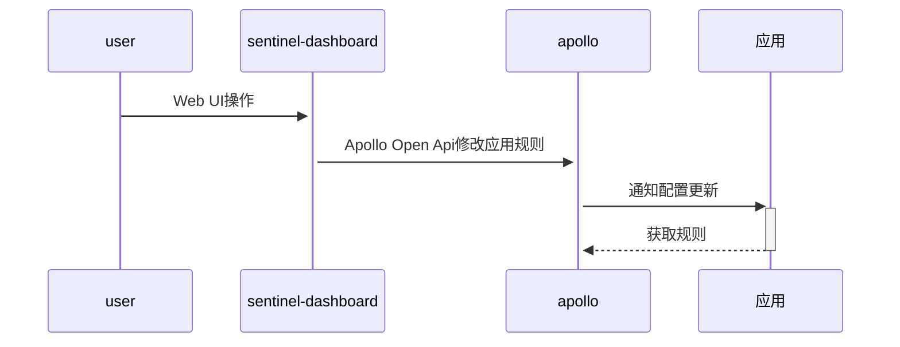

# 总览

如官方参考图

远程配置中心在这里是[Apollo分布式配置中心](https://github.com/ctripcorp/apollo/)

每个app引入sentinel的客户端，会做下面2件事

* 从远程配置中心获取规则
* 发送心跳到sentinel dashboard

配置更新流程如下

```mermaid
sequenceDiagram

  user ->>+ sentinel-dashboard: Web UI操作
  sentinel-dashboard ->>+ apollo: Apollo Open Api修改应用规则
  apollo ->>+ 应用: 通知配置更新
  应用 -->>- apollo: 获取规则
```

app只负责从Apollo上读取配置，读到什么就使用什么