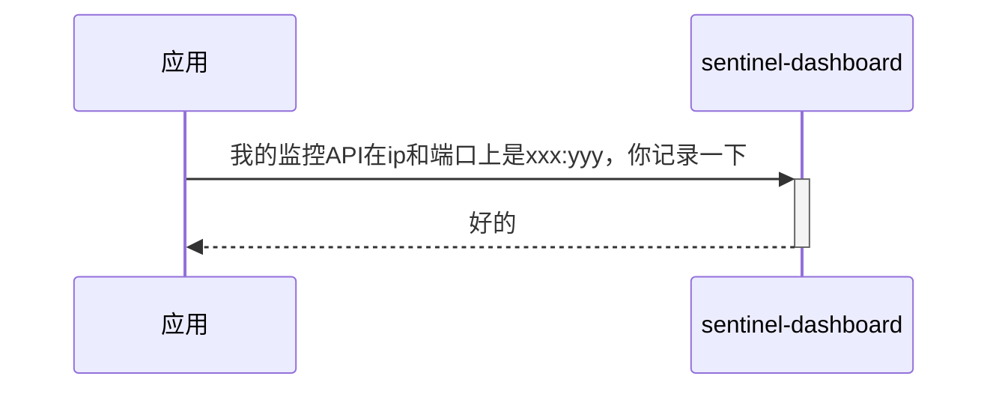
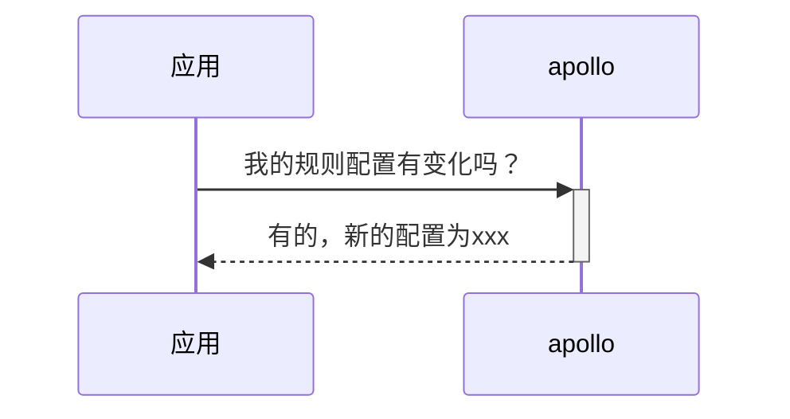
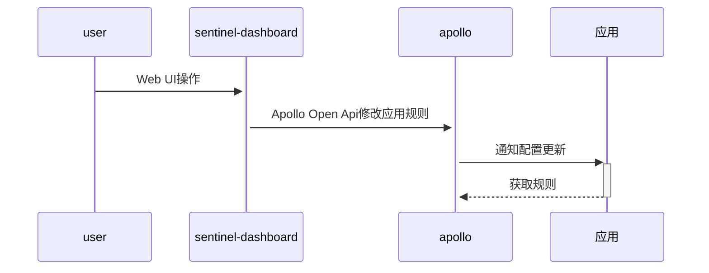
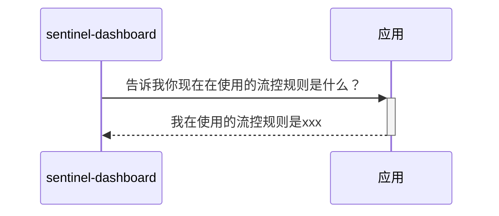

# 总览

如官方参考图

远程配置中心在这里是[Apollo分布式配置中心](https://github.com/ctripcorp/apollo/)

Sentinel Dashboard被修改，代码在https://github.com/Anilople/Sentinel

术语介绍：

* sentinel-dashboard、Sentinel Dashboard、Sentinel控制台、控制台 表示的是相同的意思
* sentinel-client、sentinel客户端 表示的是相同的意思

## sentinel客户端

每个应用会使用sentinel客户端，sentinel客户端会做下面几件事

* 初始化一个http-server

* 发送心跳到sentinel-dashboard

* 从远程配置中心获取规则

### 初始化一个http-server

监控API，默认端口是8719

给sentinel-dashboard查询流控规则

### 发送心跳到sentinel-dashboard

在应用初始化sentinel客户端后，sentinel客户端每隔一段时间（默认是10s），就会往sentinel-dashboard发送心跳

sentinel-dashboard根据应用发来的心跳，得知应用相关的信息，在控制台的**机器列表**页面，可以看到有那些机器

### 从远程配置中心获取规则

应用只负责从Apollo上读取配置，读到什么就使用什么，从应用的视角，规则的读取如下图

## sentinel-dashboard

sentinel控制台用来增删查改应用的流控规则

流控规则更新流程如下

控制台只负责响应用户在Web上的操作，用户对某个应用的流控规则修改后，控制台会将规则推送到Apollo

在查询应用的规则上，控制台并不会到Apollo上进行查询，而是通过应用的监控API，来查询

所以可以验证，推送到Apollo上的配置，是否已经生效了