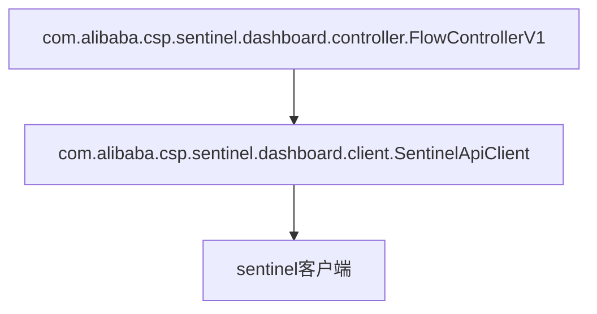
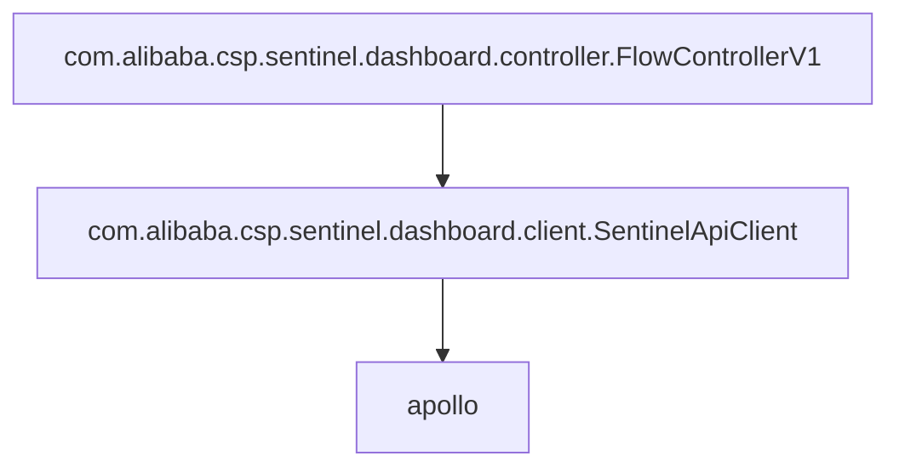

# sentinel-dashboard

控制台的代码需要进行修改，这里会从代码结构上进行介绍，如何修改

## 配置

为了方便管理sentinel控制台，sentinel控制台的配置，也会被放在Apollo上

## 持久化

对metric数据不进行持久化，所以实时监控仍旧只能保留几分钟的数据

为了外部依赖尽可能的少，放弃了使用MySQL等数据库作为sentinel控制台的存储

而是使用了Apollo的私有namespace，作为key-value存储

## 规则推送

sentinel-dashboard默认将规则的变化推送到sentinel客户端，所以**只要找到规则推送的代码，将其修改成推送到apollo上就好了**

通过前端进行层层追踪，发现规则的增删改如下



将其修改成



即可满足需求，使用了[com.alibaba.csp.sentinel.dashboard.apollo.client.CustomSentinelApiClient](https://github.com/Anilople/Sentinel/blob/master/sentinel-dashboard/src/main/java/com/alibaba/csp/sentinel/dashboard/apollo/client/CustomSentinelApiClient.java)来继承并覆盖默认的[com.alibaba.csp.sentinel.dashboard.client.SentinelApiClient](https://github.com/Anilople/Sentinel/blob/master/sentinel-dashboard/src/main/java/com/alibaba/csp/sentinel/dashboard/client/SentinelApiClient.java)，并在其中关键的一些方法，把对应用的HTTP调用，修改成对Apollo的HTTP调用（使用[Apollo开放平台](https://ctripcorp.github.io/apollo/#/zh/usage/apollo-open-api-platform)），有些方法尚未实现

所有源码都在模块`sentinel-dashboard`中，Java Package为`com.alibaba.csp.sentinel.dashboard.apollo`

修改源码的原则有：

* 尽量不修改官方源码，方便后续的升级

## 高可用

sentinel控制台单机部署，没有高可用

如果sentinel控制台程序崩溃，将会无法修改应用配置，但是不影响应用的正常运行


## 多机房

根据apollo.cluster作为机房划分的依据

参考[三、集群独立配置说明](https://ctripcorp.github.io/apollo/#/zh/usage/apollo-user-guide?id=%e4%b8%89%e3%80%81%e9%9b%86%e7%be%a4%e7%8b%ac%e7%ab%8b%e9%85%8d%e7%bd%ae%e8%af%b4%e6%98%8e)

一个机房，一个控制台

从需求上认为，每个机房的限流规则都不一样，当然也可以通过修改配置的方式，所有机房的应用都使用同一份限流规则
## 运维

sentinel控制台在运维上应该尽可能友好，例如多个环境隔离的sentinel控制台之间，配置同步要尽可能地方便

这里有2个思路：

* 利用Apollo的配置同步功能，但是需要Apollo-Portal本身没有环境隔离
* sentinel控制台实现流控规则的导入导出，由用户手动从环境A的控制台中导出规则，再到环境B的控制台上导入规则

选择后者，因为可以在Apollo-Portal本身有环境隔离的情况下，方便流控规则的迁移

## 日志

默认的logback配置不可用，为了生产环境的日志可用

以代码改动最少为原则，不添加`logback.xml`作为logback的配置，而是直接使用配置`logging.xxx`来进行logback配置，并放在Apollo上，所以需要使用如下配置

```properties
# put apollo initialization before logging system initialization
apollo.bootstrap.eagerLoad.enabled=true
```

参考 https://docs.spring.io/spring-boot/docs/2.0.9.RELEASE/reference/html/boot-features-logging.html

Spring Boot的logback默认配置在 https://github.com/spring-projects/spring-boot/tree/v2.0.9.RELEASE/spring-boot-project/spring-boot/src/main/resources/org/springframework/boot/logging/logback