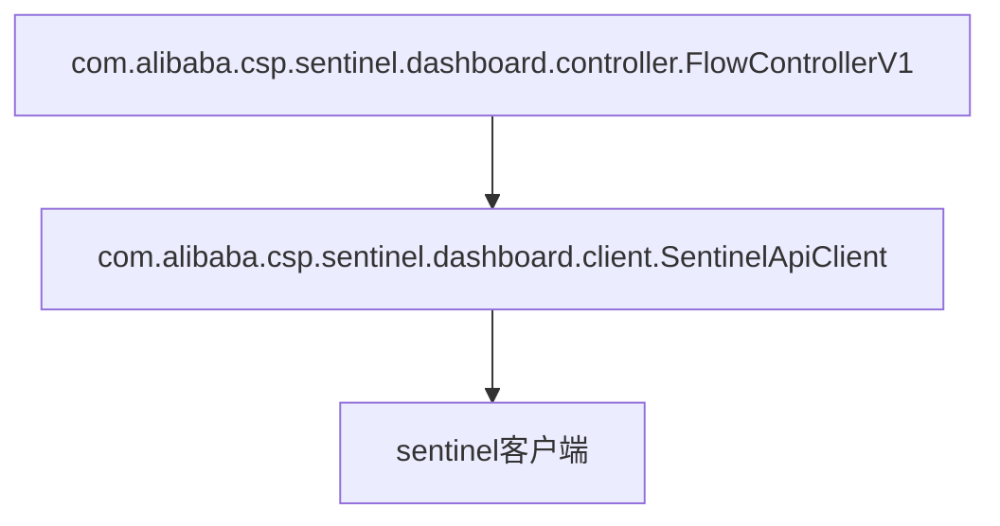
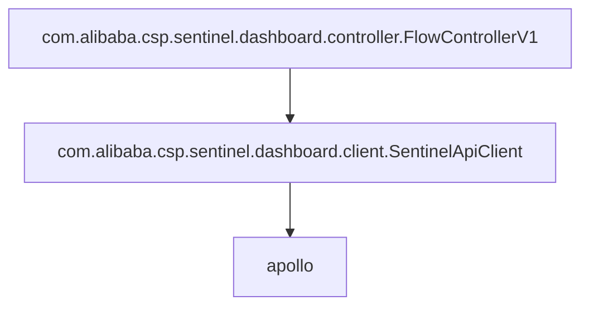

# sentinel-dashboard

## api

sentinel-dashboard默认将规则的变化推送到sentinel客户端，所以只要找到规则推送的代码，将其修改成推送到apollo上就好了

通过前端进行network检查，发现规则的增删改如下

将其修改成

即可满足需求

所有源码都在模块`sentinel-dashboard`中，Java Package为`com.alibaba.csp.sentinel.dashboard.apollo`

修改源码的原则有：

* 尽量不修改官方源码，方便后续的升级

## log

参考 https://docs.spring.io/spring-boot/docs/2.0.9.RELEASE/reference/html/boot-features-logging.html

Spring Boot的logback默认配置在 https://github.com/spring-projects/spring-boot/tree/v2.0.9.RELEASE/spring-boot-project/spring-boot/src/main/resources/org/springframework/boot/logging/logback