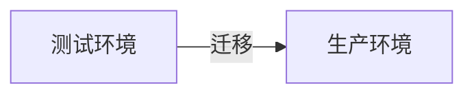

# sentinel控制台

sentinel控制台在使用上，基本都是WebUI上的操作

这里只对定制后的独有功能做介绍

主要的功能都在**首页**（左上方）上

## 规则迁移

可以将一个sentinel控制台上看到的规则，进行导出，然后再在另一个sentinel控制台，进行导入

适合环境隔离的场景，例如生产和测试存在物理隔离的时候，可以很方便地将测试环境的规则，迁移到生产环境

### 规则导出

可以将一个应用的规则，或者多个应用的规则，导出成**.zip**文件

点击导出即可

会生成一个.zip文件

> 注意：如果不是特殊需求，推荐每次只导出一个应用的规则

> 注意：在**首页**有个按钮可以导出所有应用的所有规则，适合获取某个环境的所有规则

### 规则导入

使用导出的.zip文件，在**首页**可以导入规则

选择.zip文件，然后再点击**导入**即可

> 注意：会覆盖已有的规则，细节请参考Sentinel控制台首页里的文档

如果输入了`JSESSIONID`，那么Sentinel控制台会自动以Apollo Portal超级管理员的身份，对需要导入配置的应用，进行赋权，使得Sentinel控制台可以使用Apollo开放平台，来修改它们的配置

#### 场景1

需要新上线一堆应用到生产环境，但是又不想在Apollo Portal上通过鼠标键盘多次操作，进行赋权

可以在测试环境导出这些应用的规则，然后在生产环境的Sentinel控制台，输入`JSESSIONID`，这样就可以自动赋权多个被管理的AppId了

## 应用查询

运维功能

不会改变状态，可以放心使用
## 注册应用

运维功能

目的是为了减少Apollo Portal管理员的工作强度

注册 = Apollo开放平台授权被管理的AppId + Sentinel控制台存储应用
## 清理应用

为了保障Sentinel控制台存储的应用和Apollo项目在数据上的一致性设计

不会清理应用的规则， 只会清理Sentinel控制台自身的存储
## 项目文档

在Sentinel控制台首页，最下方，有文档的链接以及二维码，可以在互联网环境来进行访问

## 更多功能

请查看Sentinel控制台首页